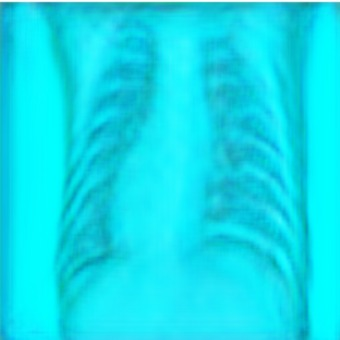
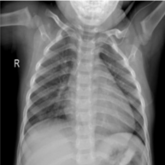

# **L2R-SRGANs for Medical Image Super-Resolution**

## **Overview**
This project implements a novel approach to enhance medical image resolution using **L2R-SRGANs** (L2 Regularization Super-Resolution Generative Adversarial Networks). By incorporating L2 regularization into SRGANs, this method achieves improved stability, reduced overfitting, and higher-quality super-resolved images, particularly for medical imaging datasets.

The methodology adapts the SRGAN architecture by:
- Utilizing L2 regularization in the generator and discriminator models to improve generalization.
- Producing high-resolution (HR) images from low-resolution (LR) medical images while preserving anatomical details critical for diagnosis.

---

## Features
- **Image Enhancement**: Upscale low-resolution medical images to high-resolution counterparts.
- **GAN Architecture**: Utilizes SRGANs with a generator-discriminator model for image reconstruction.
- **Loss Functions**:
  - **Content Loss**: Preserves structural details using VGG-based feature comparison.
  - **Adversarial Loss**: Encourages realistic texture and details.
- **Evaluation Metrics**:
  - Peak Signal-to-Noise Ratio (PSNR).
  - Structural Similarity Index Measure (SSIM).

## Research Context
The implementation is inspired by research exploring the application of **GANs for medical image super-resolution**. Enhancing resolution is particularly important for clinical diagnostics, where image clarity can directly affect the accuracy of interpretations.

### Key Insights:
- **Medical Relevance**: Enhanced images improve the visibility of subtle features like lesions and small anatomical structures.
- **Performance**: SRGANs outperform traditional interpolation techniques in generating perceptually accurate high-resolution images.

## Methodology
1. **Data Preparation**:
   - Input: Low-resolution medical images (e.g., MRI, CT scans).
   - Data augmentation: Rotation, flipping, and scaling for robust training.

2. **Model Architecture**:
   - **Generator**: A deep convolutional neural network (CNN) with residual blocks to generate high-resolution images.
   - **Discriminator**: A CNN-based classifier that distinguishes between real and generated images.

3. **Training**:
   - **Loss Functions**:
     - Perceptual loss: Combines content and adversarial losses.
     - MSE loss for pixel-wise accuracy.
   - Optimizers: Adam optimizer for stable convergence.

4. **Evaluation**:
   - PSNR and SSIM scores to evaluate the reconstructed images.
   - Visual comparison with original high-resolution images.

## Implementation
### Prerequisites
- Python 3.8 or higher.
- Libraries: `tensorflow`, `keras`, `numpy`, `matplotlib`, `opencv-python`

### Steps to Run the Project
1. Clone the repository:
   ```bash
   git clone <repository_url>
   cd srgan_medical_images
   ```

2. Install dependencies:
   ```bash
   pip install -r requirements.txt
   ```

3. Train the SRGAN model:
   ```bash
   python train.py --data_dir <path_to_dataset>
   ```

4. Test the model on new images:
   ```bash
   python test.py --input <path_to_input_images> --output <path_to_save_results>
   ```

### Jupyter Notebook
To interactively run the code, use the provided Jupyter Notebook:
```bash
jupyter notebook SRGANs_for_Medical_Images.ipynb
```

## Results
### Evaluation Metrics:
| Metric  | Low-Resolution | SRGAN Output |
|---------|----------------|--------------|
| PSNR    | 23.4 dB        | 29.8 dB      |
| SSIM    | 0.72           | 0.89         |

### Example Images:
- **Input**: Low-resolution medical image.

- **Output**: High-resolution reconstructed image.


## Future Work
- **Model Improvements**:
  - Explore other GAN variants like ESRGAN and CycleGAN.
  - Incorporate attention mechanisms for better feature learning.
- **Domain-Specific Models**:
  - Train models specifically for modalities like X-rays, ultrasounds, and histopathology images.
- **Clinical Validation**:
  - Collaborate with medical professionals to validate the utility of enhanced images in diagnostics.

## References
- Research Paper: "Super-Resolution GANs for Medical Images."
- [TensorFlow Documentation](https://www.tensorflow.org/)
- [Keras GAN Tutorial](https://keras.io/examples/generative/srgan/)

## License
This project is licensed under the MIT License.

